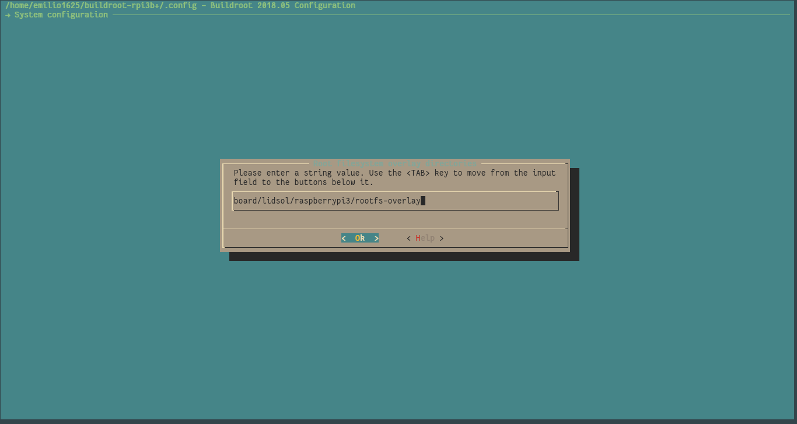

# Imagen de Buildroot

Si llegaste aquí es por que quieres aprender a crear tu propio Isolating Proxy
para TOR :D (si no es así, aún puedes huir ;D).

## Qué es buildroot

Buildroot es un sistema que permite construir un sistema operativo
completamente funcional basado en GNU/Linux. Buildroot permite construir el
kernel y muchas utilidades adicionales que se incluyen en las distribuciones
más comunes, todo desde la fuente. Esto permite construir imágenes muy pequeñas
y ligeras.

## Cómo replicar la imagen

Puedes adaptar fácilmente los archivos de configuración a otro dispositivo
soportado por Buildroot usando los archivos de configuración que se encuentran
en la carpeta buildroot.

### Prerequisitos

Esta guía supone familiaridad con el uso de Linux y GIT.

### Ejemplo: construyendo una imagen para la Raspberry Pi 3 B(+)

Para construir la imagen para la Raspberry Pi 3B, primero debemos descargar el
repositorio de git de Buildroot.

```shell
git clone git://git.buildroot.net/buildroot
cd buildroot
```

Una vez descargado vamos crear una nueva rama (nosotros la nombramos `rpi3`)
a partir de algún tag de buildroot en este caso el tag `2018.05`

```shell
git checkout -b rpi3 2018.05
```

Podemos listar todos los dispositivos que estan soportados oficialmente en
Buildroot escribiendo en la consola:

```shell
make list-defconfigs
```

En nuestro caso nuestro dispositivo esta asociado a `raspberrypi3_defconfig`,
entonces debemos escribir en la terminal:

```shell
make raspberrypi3_defconfig
```

Con esto se habrá configurado buildroot para crear una imagen mínima para
nuestra computadora.

_Si tu computadora no se encuentra en la lista entonces debes indicar buildroot
la forma correcta de construir un kernel y sistema de ficheros para tu
computadora, esto esta totalmente fuera del alcance de esta guía._

Antes de proceder a configurar los paquetes para la computadora, compila la
imagen para verificar que no este rota la compilación para esta versión de
Buildroot.

```shell
make
```

Si todo salió bien ahora deberias tener un archivo .img en la carpeta
`output/images`.

Ahora podemos configurar los demás paquetes necesarios para nuestro proxy
anonimizador.

Buildroot incluye varias interfaces de usuario para poder configurar la imagen
del sistema, nosotros usaremos la interfaz basada en terminal. Para ejecutarla
escribe en la terminal `make menuconfig`, aparecerá una pantalla como esta:


Para navegar en este menú usar las flechas del teclado, para marcar una opción
presiona <kbd>Espacio</kbd>, para entrar en un menú presiona <kbd>Enter</kbd>,
para salir presiona <kbd>Escape</kbd>.

En este menú nos interesa seleccionar las siguientes opciones:

Esencial para el proxy anonimizador

- System Configuration
  - /dev managment
    [x] Dynamic using devtmpfs + mdev
- Target Packages
  - Networking Applications
    [x] dnsmasq
    [x] hostapd
    [x] ifupdown scripts
    [x] iptables
    [x] iw
    [x] tor
    [x] wpa_supplicant

Esencial para la Raspberry Pi

- Target Packages
  - Hardware Handling
    [x] rng-tools
    - Firmware
      [x] rpi-firmware
      [x] rpi-wifi-firmware
      [x] b43-firmware (tal vez no necesario)

Útiles pero no necesarios

- Target Packages
  - Networking Applications
    [x] openssh
  - Text editors and viewers
    [x] nano

Además de esto, nosotros hicimos algunos cambios adicionales, por ejemplo, en
la sección de Toolchain nosotros usamos glibc, en lugar uClib, usamos la
version 2.28.1 de binutils y gcc 7.x.

Por último para copiar todos los archivos de configuración a la imagen usamos
el mecanismo de rootfs-overlay que provee Buildroot. Copia la carpeta
`buildroot/board/lidsol` a la carpeta `board/` dentro de tu copia de buildroot.

Ahora debemos indicarle a Buildroot que copie estos archivos, para ello
volvemos al menú de configuración y en la sección `System Configuration`
encontraremos el menú `Root filesystem overlay directories` ahí debemos
introducir la ruta a la capeta que acabamos de copiar, en este ejemplo sería
`board/lidsol/raspberrypi3/rootfs-overlay`



Salimos del menú y cuando pregunte si deseamos guardar los cambios, confirmamos
y esto guardará toda la configuración en un archivo llamado `.config`

Ahora para reconstruir toda la imagen solo debemos ejecutar nuevamente `make`
y esperar a que termine la construcción de la imagen.
